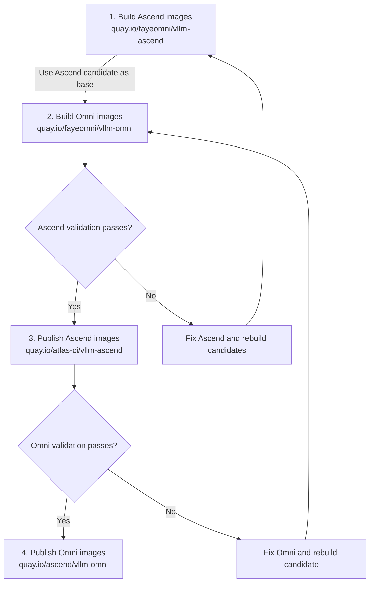

# ascend-image-ci

CI workflows for building and publishing multi-architecture Ascend/NPU container
images (`linux/amd64` and `linux/arm64`). Ascend builds use Dockerfiles from
[vllm-project/vllm-ascend](https://github.com/vllm-project/vllm-ascend);
the standard Omni build uses this repository's
[`docker/vllm-omni/Dockerfile.npu`](docker/vllm-omni/Dockerfile.npu) and clones
[vllm-project/vllm-omni](https://github.com/vllm-project/vllm-omni) at build time.

## Standard release process



1. Build Ascend candidate images in `quay.io/fayeomni/vllm-ascend`.
2. Build Omni candidate images in `quay.io/fayeomni/vllm-omni`, using those Ascend images as the base.
3. After Ascend validation passes, publish the validated Ascend images to `quay.io/atlas-ci/vllm-ascend`.
4. After Omni validation passes, publish the validated Omni images to `quay.io/ascend/vllm-omni`.

Build success alone does not satisfy either validation gate. Publishing copies
the validated images, including all architectures, without rebuilding them.
The standard release workflows below are dispatched manually; they do not
automatically enforce the hardware validation gates.

### Prerequisites

Configure these Actions variables and secrets in `FayeSpica/ascend-image-ci`.
Use Quay accounts with write access to the corresponding destination repositories:

- `QUAY_USERNAME` / `QUAY_PASSWORD`: variable / secret for `quay.io/fayeomni/vllm-ascend` and `quay.io/fayeomni/vllm-omni`.
- `ATLAS_CI_QUAY_USERNAME` / `ATLAS_CI_QUAY_PASSWORD`: variable / secret for `quay.io/atlas-ci/vllm-ascend`.
- `ASCEND_QUAY_USERNAME` / `ASCEND_QUAY_PASSWORD`: variable / secret for `quay.io/ascend/vllm-omni`.

### 1. Build Ascend images

The following commands use v0.28.0 and Ascend PR #14898 with patch #15321 as
an example. Select the refs and release tags for your release before running them.

```bash
gh workflow run build_images.yaml --repo FayeSpica/ascend-image-ci \
  -f targets=ascend \
  -f vllm_tag=v0.28.0 \
  -f ascend_ref=refs/pull/14898/head \
  -f patch_refs=15321
```

This builds `quay.io/fayeomni/vllm-ascend:v0.28.0-pr14898-patch15321`
for A2, plus tags ending in `-a3`, `-a5`, and `-310p`.
Each hardware tag contains both CPU architectures.

- `ascend_ref` accepts a branch, tag, commit, or PR ref. PR refs become `pr<N>` in image tags; full commit SHAs become their first eight characters.
- `vllm_commit` selects a specific vLLM commit and takes precedence over `vllm_tag`; its first eight characters become the vLLM tag fragment.
- `patch_refs` is optional and accepts comma-separated Ascend PR numbers. Patches are applied with `git apply`; a failure stops the build. Omit it for an unpatched build and remove the corresponding `-patch<N>` fragment from subsequent commands.

Wait for the build and manifest merge to complete before building Omni:

```bash
gh run list --repo FayeSpica/ascend-image-ci --workflow build_images.yaml --limit 5
gh run watch <run-id> --repo FayeSpica/ascend-image-ci --exit-status
```

### 2. Build Omni images

Use the Ascend candidate tag from step 1 as the base. Pass tags without hardware
suffixes; `build_omni_images.yaml` appends them for A3, A5, and 310P automatically.

```bash
gh workflow run build_omni_images.yaml --repo FayeSpica/ascend-image-ci \
  -f omni_ref=v0.28.0 \
  -f vllm_ascend_image=quay.io/fayeomni/vllm-ascend \
  -f vllm_ascend_base_tag=v0.28.0-pr14898-patch15321 \
  -f omni_image=quay.io/fayeomni/vllm-omni \
  -f omni_tag=v0.28.0
```

This builds `quay.io/fayeomni/vllm-omni:v0.28.0` for A2 and the corresponding
`v0.28.0-a3`, `v0.28.0-a5`, and `v0.28.0-310p` tags. `omni_ref` must be a
branch or tag because this Dockerfile uses `git clone --branch`.

### 3. Validate Ascend and publish to atlas-ci

Validate the exact Ascend candidate on the matching hardware before publishing.
Record the source digest, hardware and dependency versions, test commands,
results, and logs. Check NPU operations and the intended vLLM workloads; image
build or import success alone is insufficient. Track untested hardware and CPU
architectures explicitly, and publish only variants that meet the release's
validation requirements.

After validation passes, copy each approved hardware tag. For example, publish A2:

```bash
gh workflow run retag_image.yaml --repo FayeSpica/ascend-image-ci \
  -f source_image=quay.io/fayeomni/vllm-ascend:v0.28.0-pr14898-patch15321 \
  -f dest_image=quay.io/atlas-ci/vllm-ascend:v0.28.0
```

Repeat for each approved A3, A5, or 310P variant by appending `-a3`, `-a5`, or
`-310p` to **both** source and destination tags. Each invocation copies one
hardware variant and all its CPU architectures using `skopeo copy --all`.
Use the recorded source digest (`image@sha256:...`) instead of a tag if the
candidate tag may have changed since validation.

### 4. Validate Omni and publish to ascend

Validate the exact Omni candidate on the matching hardware with the intended
model workloads. Retain test logs, check worker health, and inspect generated
artifacts (for example, non-silent audio and valid image/video output). Record
failures and untested coverage before deciding which variants are ready.

After Omni validation passes, publish A2 with:

```bash
gh workflow run retag_image_to_ascend.yaml --repo FayeSpica/ascend-image-ci \
  -f source_image=quay.io/fayeomni/vllm-omni:v0.28.0 \
  -f dest_image=quay.io/ascend/vllm-omni:v0.28.0
```

Repeat for each approved variant, appending `-a3`, `-a5`, or `-310p` to both
tags. As with Ascend, publish the validated source digest if its tag can change.

For both publication steps, wait for the corresponding retag run to succeed
and inspect its destination-manifest output for `linux/amd64` and `linux/arm64`.
A successful workflow dispatch only queues the copy; it does not mean publication
has completed.

## Omni nightly builds

`build_omni_nightly.yaml` runs daily at **02:00 Asia/Shanghai** (`0 18 * * *`
in UTC), with a manual trigger for reruns. GitHub schedules can be delayed.
Each run resolves the latest `vllm-project/vllm-omni` main commit once, then
builds A2/A3/A5/310P for both amd64 and arm64 using that exact SHA.

The default base is `quay.io/atlas-ci/vllm-ascend:v0.28.0`, with `-a3`, `-a5`,
and `-310p` suffixes. Optional Actions variables `OMNI_NIGHTLY_BASE_IMAGE` and
`OMNI_NIGHTLY_BASE_TAG` override the repository and unsuffixed tag. Each base
manifest must include both architectures and is pinned by digest for the run.
The Dockerfile also accepts `VLLM_ASCEND_BASE` as a complete image reference
and `VLLM_OMNI_COMMIT` as a full commit SHA; existing branch/tag builds retain
their `VLLM_OMNI_REF` behavior when no commit is supplied.

Images are first built in `quay.io/fayeomni/vllm-omni` using rolling tags:
`nightly`, `nightly-a3`, `nightly-a5`, and `nightly-310p`. Each run overwrites
these tags; per-architecture staging tags also use fixed names.
After **all eight builds and all four manifest checks succeed**, the workflow
checks each architecture's Omni revision label, then copies the images by
digest to `quay.io/ascend/vllm-omni` with `skopeo copy --all --preserve-digests`.
Only `nightly`, `nightly-a3`, `nightly-a5`, and `nightly-310p` are published
to ascend. Each copied rolling tag is verified against its candidate digest.
Neither repository receives new date, commit, or run-specific nightly tags.

Configure `QUAY_USERNAME` / `QUAY_PASSWORD` for candidate builds and
`ASCEND_QUAY_USERNAME` / `ASCEND_QUAY_PASSWORD` for publication, as described
above. `QUAY_OAUTH_TOKEN` remains optional for cleaning interim per-arch tags.

```bash
gh workflow run build_omni_nightly.yaml --repo FayeSpica/ascend-image-ci
```

The workflow must be on the default branch for scheduled execution. Nightly
runs share a concurrency group and do not cancel an in-progress run. Every
night builds even when the upstream SHA is unchanged. When retrying a run,
use **Re-run all jobs**, so all builds use the same resolved inputs. Avoid
rerunning only failed jobs against staging tags that a later run may overwrite.

A failed build or candidate check prevents publication to ascend. Registry
updates across four tags are not atomic: a copy or verification failure can
leave a partially published run. Job summaries record source/base digests,
copy starts, copy completions and verified destinations to identify that state.
Historical nightly images are not retained by this workflow. Source revisions
and digests remain in image metadata and job summaries. Previously published
long tags require separate cleanup; this change does not delete them.

Nightly publication is gated on builds and manifest/revision checks, **not real
NPU model tests**. No hardware acceptance is claimed. The manual standard
release process above retains its hardware validation requirements.

Local checks for nightly changes:

```bash
python3 -m unittest discover -s tests -v
actionlint .github/workflows/build_omni_nightly.yaml
git diff --check
```

## Model matrix

The repository publishes the
[Omni hardware model matrix](https://fayespica.github.io/ascend-image-ci/)
with GitHub Pages through `deploy-pages.yaml`.

## Files

- `.github/workflows/build_images.yaml` — Ascend build and optional upstream A2/A3 Omni build.
- `.github/workflows/build_omni_nightly.yaml` — scheduled Omni builds and automatic retag to ascend.
- `scripts/omni_nightly.py` — resolve pinned inputs and verify/promote nightly manifests.
- `.github/workflows/build_omni_images.yaml` — four-variant Omni build using the local Dockerfile.
- `.github/workflows/_build_push_image.yaml` — reusable multi-architecture build and manifest merge.
- `.github/workflows/retag_image.yaml` — copy validated Ascend images to `atlas-ci`.
- `.github/workflows/retag_image_to_ascend.yaml` — copy validated Omni images to `ascend`.
- `docker/vllm-omni/Dockerfile.npu` — Omni image dependencies and source installation.

### Omni nightly 历史保留

每天北京时间 02:00 的 `build_omni_nightly.yaml` 在所有候选验证通过后，先发布 `quay.io/ascend/vllm-omni:nightly-YYYYMMDD-<7位Omni SHA>[-a3|-a5|-310p]`，再更新对应滚动 `nightly[-a3|-a5|-310p]`。A2 无硬件后缀，两种标签对应相同 digest。

全部发布成功后清理日期早于北京时间今天减 13 天的同格式历史标签；保留今天及前 13 天。清理复用 `ASCEND_QUAY_USERNAME` / `ASCEND_QUAY_PASSWORD` 换取 Registry Token，按 tag 删除并验证其他标签和 digest 未变，无需 OAuth Secret。连续没有成功发布时，历史标签可能暂时超过 14 天。日期来自 prepare 阶段；同日同 SHA 重跑覆盖同名标签。Pages JSON 仍独立人工维护。
